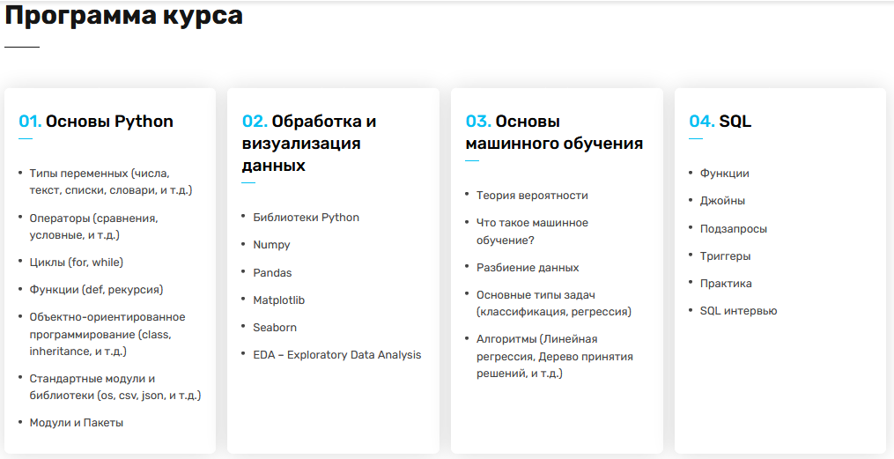

# Data Science
### Финальные проекты по курсу [**Data Science**](https://ableacademy.kz/#data) в Online Able Academy

#### Описание курса:
Курс по _Data Science_ для новичков представляет собой онлайн обучение, охватывающее четыре основных блока:
[_**Блок 1**_](https://github.com/bekasDS/testGIT/tree/main/1_PYTHON/Final_project), студенты осваивают основы **Python**, начиная с установки и настройки, затем изучают базовые концепции языка, такие как переменные, условные операторы, циклы и функции.

[_**Блок 2**_](https://github.com/bekasDS/testGIT/tree/main/2_PACKEGES) посвящен предварительной обработке и визуализации данных, включая работу с библиотеками **NumPy**, **pandas**, **Matplotlib** и **Seaborn**, а также проведение различных анализов данных.

В [_**Блоке 3**_](https://github.com/bekasDS/testGIT/tree/main/3_ML) учащиеся знакомятся с основами _машинного обучения, включая теорию вероятности, линейную и логистическую регрессии, деревья принятия решений, метод опорных векторов и метрики оценки моделей_.

В  [_**Блоке 4**_](https://github.com/bekasDS/testGIT/tree/main/4_SQL) студенты изучают основы языка **SQL**, включая создание баз данных, выполнение запросов и работу с несколькими таблицами. 

Каждый блок включает в себя теоретические уроки, практические задания и проекты для применения полученных знаний.

#### Примечания
1. Проекты выложены в шаблонах _ipynb_ учебного заведения без рецензирования для публичного просмотра.
2. Условия Заданий внутри _ipynb_ (если не указано иное). Для _**SQL**_ по условию возможны связи с созданными файлами из неопубликованных уроков.
3. По техническим причинам в составе проектов отсутствуют файлы _requirements.txt_ (Python==3.11.0, если не указано иное, например, Python==3.6.13).
4. Перед запуском _ipynb_ ознакомьтесь с **Предупреждениями** в начале файла.
5. В файлах ipynb есть блоки выводов.
6. Возможная избыточность комментариев в коде относится к разъяснениям проверяющему преподователю.
7. В целях экономии места, некоторые проекты выложены (и сдавались на проверку) с урезанным количеством сгенерированных графиков.

#### Комментарии

1. Отсутствие изящности кода - необходимость следовать инструкциям преподавателя.
2. Для оптимизации обработки больших данных и генерации изображений помогут прямая запись в файл и потоки. Изменения некоторых блоков кода могут расширить и улучшить результаты.
3. Проект **Блок 3, ML, Проект 5** принимает на вход неравномерно распределённую тренировочную выборку. Дополнительные комментарии по улучшению обучению модели даны внутри кода.

