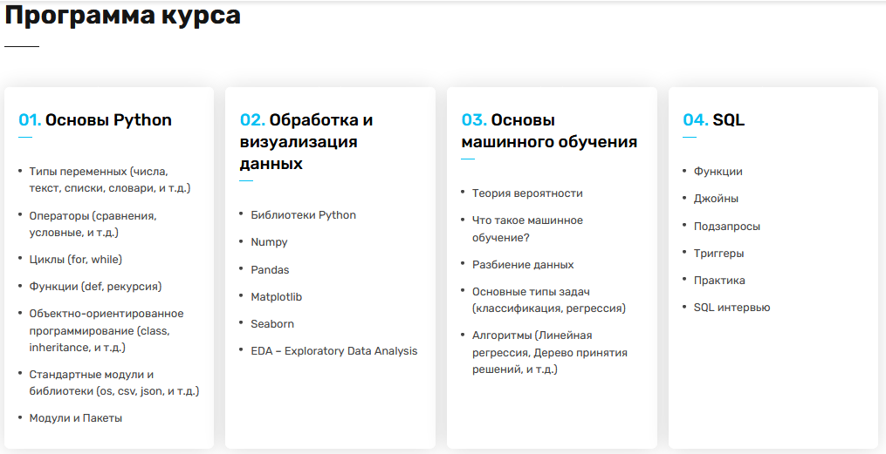

# testGIT
### Эта страница содержит мои финальные проекты по курсу [**Data Science**](https://ableacademy.kz/#data) в Online Able Academy.

#### Описание курса:

Курс по _Data Science_ для новичков представляет собой онлайн обучение, охватывающее четыре основных блока. _**В блоке 1**_, студенты осваивают основы **Python**, начиная с установки и настройки, затем изучают базовые концепции языка, такие как переменные, условные операторы, циклы и функции. _**Блок 2**_ посвящен предварительной обработке и визуализации данных, включая работу с библиотеками **NumPy**, **pandas**, **Matplotlib** и **Seaborn**, а также проведение различных анализов данных. В _**блоке 3**_ студенты изучают основы языка **SQL**, включая создание баз данных, выполнение запросов и работу с несколькими таблицами. И, наконец, в _**блоке 4**_, учащиеся знакомятся с основами _машинного обучения, включая теорию вероятности, линейную и логистическую регрессии, деревья принятия решений, метод опорных векторов и метрики оценки моделей_. Каждый блок включает в себя теоретические уроки, практические задания и проекты для применения полученных знаний.

##### Примечания
1. Задания были выполнены по заданному шаблону и условиям, если не оговорено иное внутри файлов _ipynb_.
2. Это финальные версии проектов по каждому блоку.
3. По техническим причинам в составе проектов отсутствуют файлы requirements.txt. При этом все версии файлов должны работать с Python==3.9.0 либо Python==3.11.0.
4. Некоторые операции внутри реализации процедур или классов для оптимизации обработки данных продуктивнее организовать через потоки или прямой записи в файл. Это касается большой генерации изображений, которые требовали избытка памяти и заняли несколько часов до того момента ознакомления (создания файла).
5. Перед запуском проекта, ознакомьтесь с **Предупреждениями** в начале файлов ipynb или комментариями внутри кода.
6. Возможно, количество комментариев избыточно внутри кода. Часть из них предназначалась проверяющему преподователю.
7. Это мои первые шаги работы с GGit/GitHub, поэтому могут встречаться ошибки оформления.

