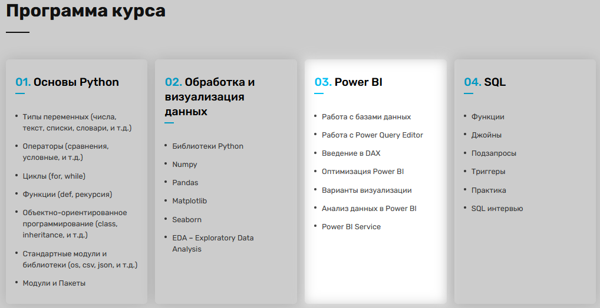

# 1. **Data Science**
### Финальные проекты по курсу [**Data Science**](https://ableacademy.kz/#data "Профессия Data Science") в Online Able Academy

#### Описание курса:
Курс по _Data Science_ для новичков представляет собой онлайн обучение, охватывающее четыре основных блока:

[_**Блок 1**_](https://github.com/bekasDS/AbleAcademyDS/tree/main/1_PYTHON/Final_project). Основы **Python**, установка и настройки, базовые концепции языка, такие как переменные, условные операторы, циклы и функции.

[_**Блок 2**_](https://github.com/bekasDS/AbleAcademyDS/tree/main/2_PACKAGES). Предварительная обработка и визуализации данных, работа с библиотеками **NumPy**, **pandas**, **Matplotlib** и **Seaborn**, а также проведение различных анализов данных.

[_**Блок 3**_](https://github.com/bekasDS/AbleAcademyDS/tree/main/3_ML). Основы _машинного обучения, включая теорию вероятности, линейную и логистическую регрессии, деревья принятия решений, метод опорных векторов и метрики оценки моделей_.

[_**Блок 4**_](https://github.com/bekasDS/AbleAcademyDS/tree/main/4_SQL). Основы языка **SQL**, создание баз данных, выполнение запросов и работу с несколькими таблицами. 

Каждый блок включает в себя теоретические уроки, практические задания и проекты для применения полученных знаний.

#### Примечания
1. Проекты выложены в шаблонах _ipynb_ учебного заведения без рецензирования для публичного просмотра.
2. Условия Заданий внутри _ipynb_ (если не указано иное). Для задач блока _**SQL**_ по условию возможны связи с созданными файлами из неопубликованных уроков.
3. По техническим причинам в составе проектов отсутствуют файлы _requirements.txt_ (Python==3.11.0, если не указано иное, например, Python==3.6.13).
4. Перед запуском _ipynb_ ознакомьтесь с **Предупреждениями** в начале файла.
5. В файлах ipynb есть секции итогов выполнения обучения моделей и мои рекомендации по улучшению результатов.
6. Возможная избыточность комментариев в коде относится к разъяснениям проверяющему преподователю.
7. В целях экономии места, некоторые проекты выложены (и сдавались на проверку) с урезанным количеством сгенерированных графиков.

#### Комментарии

1. Отсутствие изящности кода - необходимость следовать инструкциям преподавателя.
2. Для оптимизации обработки больших данных и генерации изображений помогут прямая запись в файл и потоки. Изменения некоторых блоков кода могут расширить и улучшить результаты.
3. Проект **Блок 3, ML, [Project_5](https://github.com/bekasDS/AbleAcademyDS/tree/main/3_ML/Project_5_%5BOdobrenie_kredita%5D)** принимает на вход неравномерно распределённую тренировочную выборку. Дополнительные комментарии по улучшению обучению модели даны внутри кода.
***

# 2. **Бизнес-аналитик**
##### Примечание
1. Это [дополнительный курс](https://ableacademy.kz/#business "Профессия
бизнес-аналитика"), который шёл бонусом в моём личном кабинете к основному курсу Data Science. Отмечен как [5\_Business\_Analytics](https://github.com/bekasDS/AbleAcademyDS/tree/main/5_Business_Analytics/Basics_PowerBI)

2. В состав курса входят Блоки [1](https://github.com/bekasDS/AbleAcademyDS/tree/main/1_PYTHON/Final_project), [2](https://github.com/bekasDS/AbleAcademyDS/tree/main/2_PACKAGES), [4](https://github.com/bekasDS/AbleAcademyDS/tree/main/4_SQL) из [**Data Science**](https://ableacademy.kz/#data "Профессия Data Science").
3. Выложены основные практические задания.

